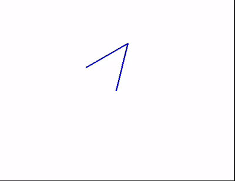

# 2D Robotic Arm Simulation

A simple 2D robotic arm simulation in Python using Pygame. The arm moves to the position of your mouse click using PID control and Jacobian-based inverse kinematics.

## Features
- Two-link robotic arm in 2D
- Forward kinematics to calculate end-effector position
- Jacobian-based inverse kinematics
- PID control for smooth motion
- Interactive: click anywhere in the window to move the arm

## Installation

1. Clone the repository:
```bash
git clone https://github.com/Ishan8840/2D-Robotic-Arm.git
```

2. Install dependencies:

```bash
pip install -r requirements.txt
```

## Usage

Run the simulation:

```bash
python arm.py
```

* Click anywhere in the window to move the arm’s end-effector
* Close the window to exit

## How It Works

1. **Forward Kinematics:** Calculates the end-effector’s position from joint angles
2. **Jacobian Matrix:** Maps joint velocities to end-effector velocities
3. **PID Control:** Computes velocity based on error between target and current position
4. **Joint Update:** Updates joint angles using the pseudo-inverse of the Jacobian

## Demo



## Next Steps

* Extend to 3D robotic arm simulations
* Integrate reinforcement learning (RL) for autonomous control
* Explore multi-agent or quadruped simulations

## License

MIT License
